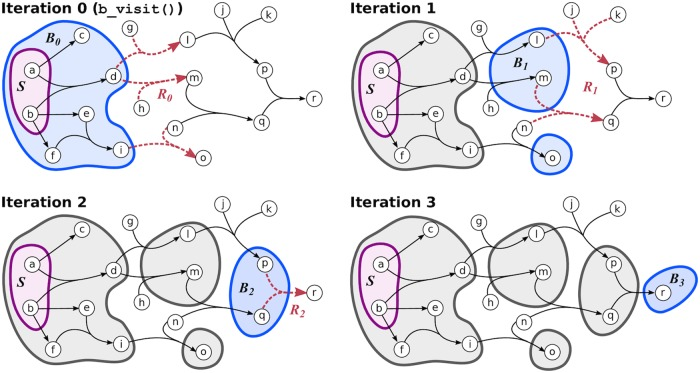

# summerResearch
## Implementation of hypergraph topology and hypergraph traversal algorithms (with relaxation) 

The algorithms presented here are outlined in depth in Franzese N, Groce A, Murali TM, Ritz A (2019) Hypergraph-based connectivity measures for signaling pathway topologies. PLOS Computational Biology 15(10): e1007384. https://doi.org/10.1371/journal.pcbi.1007384. 

To find the Python implementation of the same algorithms see: https://github.com/Murali-group/halp/blob/annabranch/halp/algorithms/directed_paths.py

### Requirements for running code: 
1. Java SE 14 

### How to run code: 
Make sure that the txt files are placed in the same location as the main function or you will have a FileNotFound error. The main function to run all of the tests is located in main.java

### Understanding the algorithm: 
The best way to grasp the algorithms in hyperAlgorithms.java is to read the aforementioned paper. Attached are some generally helpful images. Both of the images included come from the paper. Figure 8 displays the hypergraph that is constructed in the buildhypergraph function located in hyperGraph.java. Figure 9 helps to understand how the algorithm will work on this simple hypergraph. 

Figure 8: Understanding the Difference Between Reachable, Restrictive, and Traversable Hyperedges 

Figure 9: Computing BRelaxation Distance 

